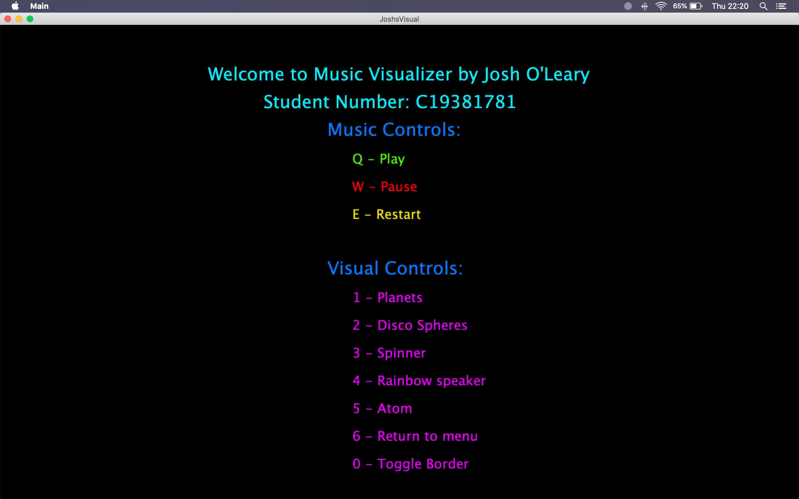
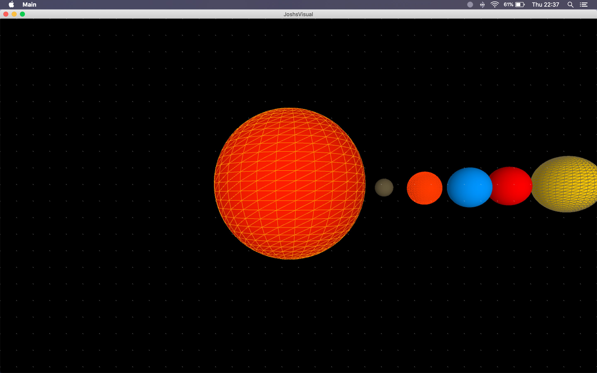
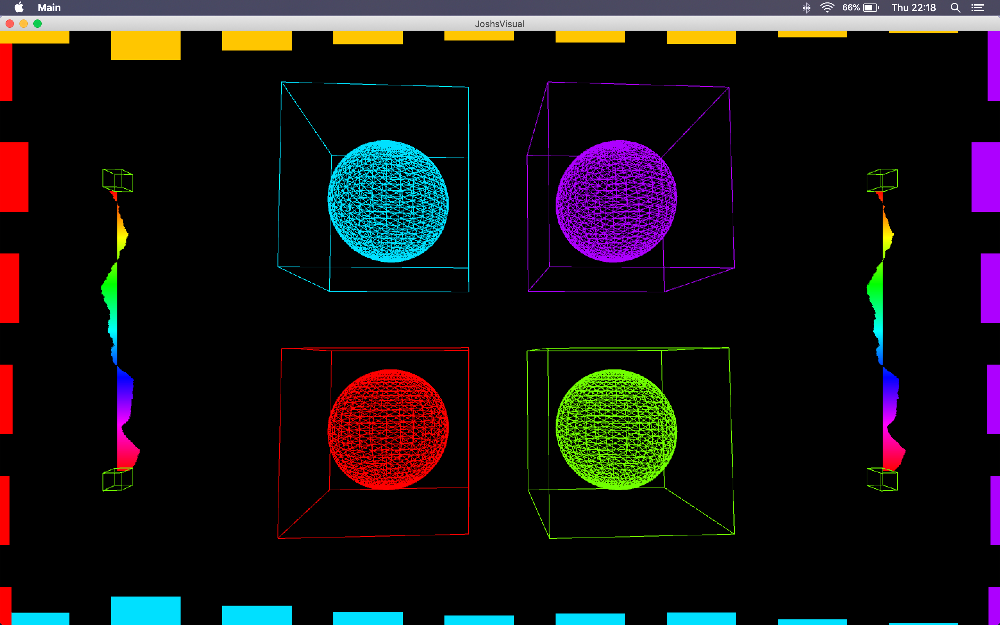
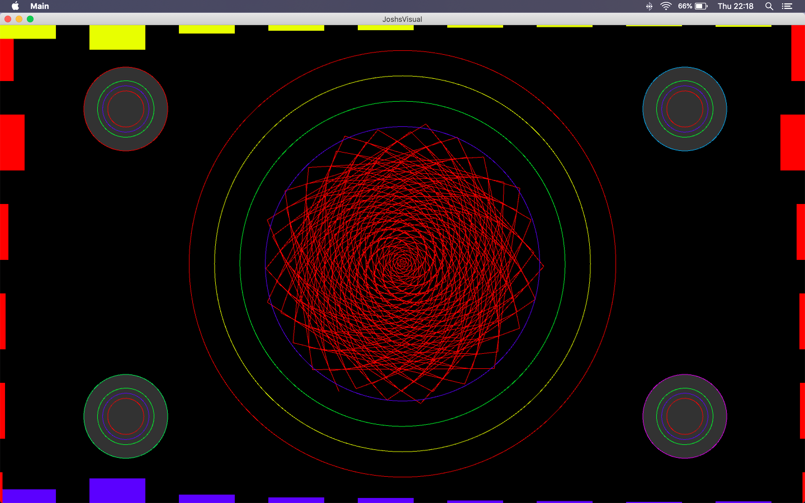
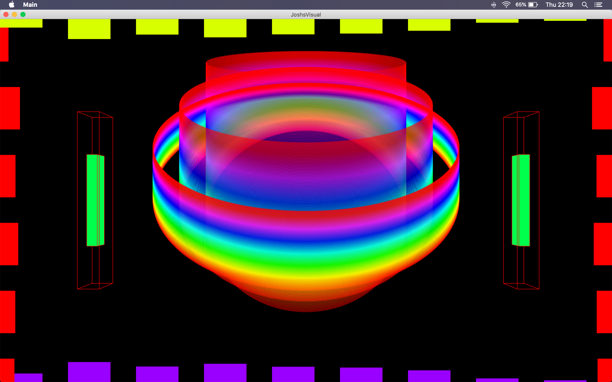
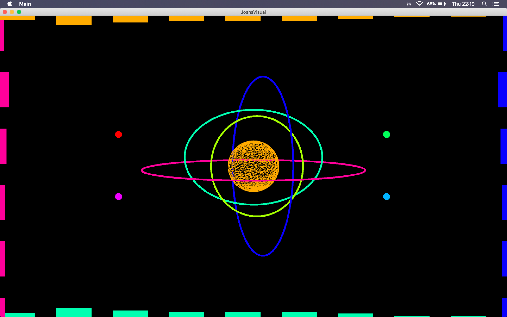

# Music Visualiser Project

*Name: Josh O'Leary*

*Student Number: C19381781*

## Intro
Welcome to the markdown for my OOP assignment, "Something beautiful to enjoy while listening to music.".
I will be writing on the following topics: 
-	Description of the assignment
-	Instructions on how to use the program
-	How it works
-	What I am most proud of in the assignment

# Description of the assignment
My assignment is a music visualizer that uses several different audio reactive visuals that respond to the amplitude of a song, these allow someone to sit back and really connect with the music as they watch the different visuals artistically portray the song they are listening to. It allows for the user to fully control what visuals they want to watch and to pause, play and restart the song at any point.

# Instructions
|*Input*|*Result*|
|-------|--------|
| Music Controls | |
| Q | Play |
| W | Pause |
| E | Restart |
| Visual Controls | |
| 1 | Planets |
| 2 | Disco Spheres |
| 3 | Spinner |
| 4 | Rainbow speaker |
| 5 | Atom |
| 9 | Menu |
| 0 | Toggle border effect |

# How it works
The program uses a combination of object oriented programming and the minim and processing java libraries to create the visuals. The program reads in the song from the data folder in the main control file known as "JoshsVisuals.java", this file sets our window size, makes an object of each visual file and reads in the users input and calls the render function to draw the other visuals. Each visual including the main menu has it's own file which has a render() function. Each of these has a boolean variable which is toggled by key presses in the control method "JoshsVisual.java" and has a condition that two of the visuals cannot be on at the same time as they are quite intricate and will simply make a mess. This file creates an instance of each and then the render function is tied behind an if statement like as follows:

```Java
//Example of boolean menu and render calling from other files uses control file "JoshsVisuals.java" using spinner visual
boolean spin = false;
Spinner sn;


 public void setup()
    {
        startMinim();
                
        // Call loadAudio to load an audio file to process 
        loadAudio("trnd.mp3");   
        colorMode(HSB);

        //class instances
        sn = new Spinner(this);
    }

if(key == '3')
        {
            spin = ! spin;  //spinner on, other visuals off
            plan = false;
            sphere = false;
            bounce = false;
            menu = false;
            ato = false;
        }
		

		if(spin)    //if bool for spin is true then render
        {
            sn.render();
        }
```

# Visuals

## Main Menu



## Planets



## Disco Spheres



## Spinner



## Rainbow Speaker



## Atom




# What I am most proud of in the assignment
it looks tasty

# Markdown Tutorial

This is *emphasis*

This is a bulleted list

- Item
- Item

This is a numbered list

1. Item
1. Item

This is a [hyperlink](http://bryanduggan.org)

# Headings
## Headings
#### Headings
##### Headings

This is code:

```Java
public void render()
{
	ui.noFill();
	ui.stroke(255);
	ui.rect(x, y, width, height);
	ui.textAlign(PApplet.CENTER, PApplet.CENTER);
	ui.text(text, x + width * 0.5f, y + height * 0.5f);
}
```

So is this without specifying the language:

```
public void render()
{
	ui.noFill();
	ui.stroke(255);
	ui.rect(x, y, width, height);
	ui.textAlign(PApplet.CENTER, PApplet.CENTER);
	ui.text(text, x + width * 0.5f, y + height * 0.5f);
}
```

This is an image using a relative URL:


This is an image using an absolute URL:


This is a youtube video:

[](https://www.youtube.com/watch?v=J2kHSSFA4NU)

This is a table:

| Heading 1 | Heading 2 |
|-----------|-----------|
|Some stuff | Some more stuff in this column |
|Some stuff | Some more stuff in this column |
|Some stuff | Some more stuff in this column |
|Some stuff | Some more stuff in this column |

